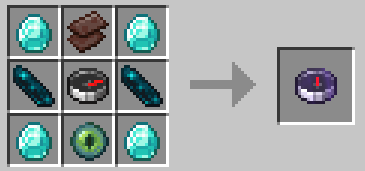

# Player Tracking Compass

This is a datapack for 1.21 that allows you to track players with a Player Tracking Compass. It is crafted with a compass, a netherite scrap, 2 echo shards, an ender eye and 4 diamonds, but you can change the recipe in [its JSON file](./data/playertracker/recipe/player_compass.json).



You can select a player by right-clicking the player compass and selecting the player to track. If the recipe isn't showing up, you may need to give yourself the recipe with this command:

```mcfunction
/recipe give @s playertracker:player_compass
```

You're free to use this datapack however you like, under the terms of the [MIT Licence](./LICENSE).
